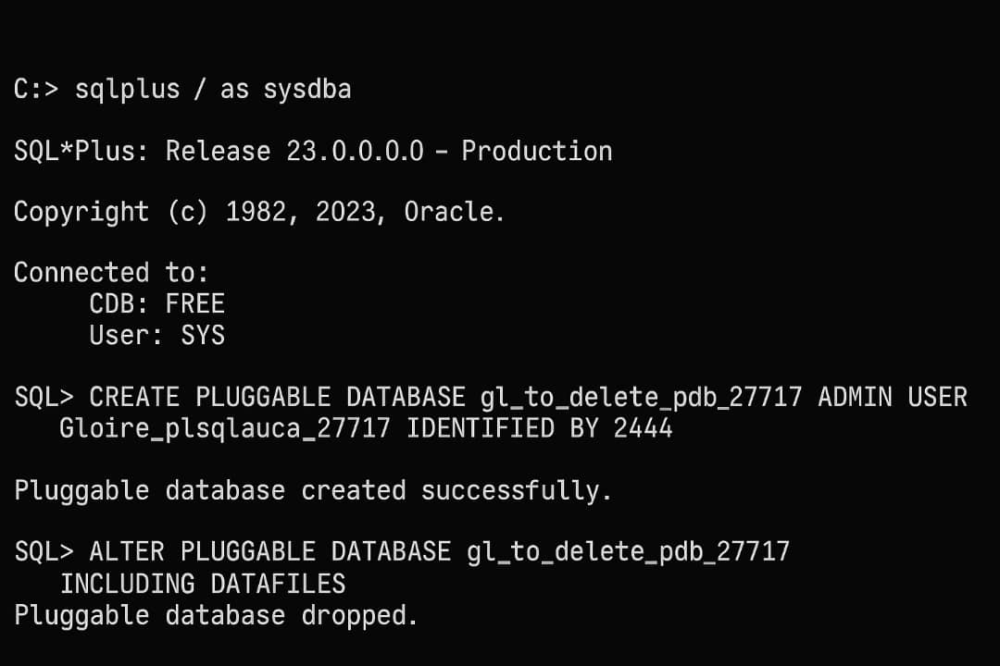

# Database Creation, Deletion & OEM

**Student Name:** Ruterana Gloire   
**Student ID:** 27717  
**Course:** PL/SQL Language  


---

##  Overview

This assignment covers:
1. Creating a new Pluggable Database (PDB)
2. Creating and deleting another PDB
3. Configuring Oracle Enterprise Manager (OEM)
4. Capturing screenshots as evidence of successful completion

---

## Task 1: Create a New Pluggable Database (PDB)

###  SQL Commands
```sql
sqlplus / as sysdba;

CREATE PLUGGABLE DATABASE gl_pdb_27717 
ADMIN USER Gloire_plsqlauca_27717 IDENTIFIED BY 2244 
FILE_NAME_CONVERT=('C:\app\oracle\oradata\FREE\pdbseed\', 'C:\app\oracle\oradata\FREE\gl_pdb_27717\');

ALTER PLUGGABLE DATABASE gl_pdb_27717 OPEN;
```
### Expected output


## Task 2: Create and Delete Another PDB
###  SQL Commands
```sql
CREATE PLUGGABLE DATABASE gl_to_delete_pdb_27717 
ADMIN USER Gloire_plsqlauca_27717 IDENTIFIED BY 2244 
FILE_NAME_CONVERT=('C:\app\oracle\oradata\FREE\pdbseed\', 'C:\app\oracle\oradata\FREE\gl_to_delete_pdb_27717\');

ALTER PLUGGABLE DATABASE gl_to_delete_pdb_27717 OPEN;

SHOW PDBS;

-- Close and Drop the PDB
ALTER PLUGGABLE DATABASE gl_to_delete_pdb_27717 CLOSE IMMEDIATE;
DROP PLUGGABLE DATABASE gl_to_delete_pdb_27717 INCLUDING DATAFILES;

SHOW PDBS;


```
### Expected output


## Task 3: Oracle Enterprise Manager (OEM)

After creating and deleting the PDBs, OEM was configured and accessed successfully.
 ## Open Oracle Enterprise Manager in Browser

# Open your browser (Chrome / Edge).

# Enter this URL:
```
https://localhost:5500/em

```
### Expected Dashboard 


# ownership of the Db


